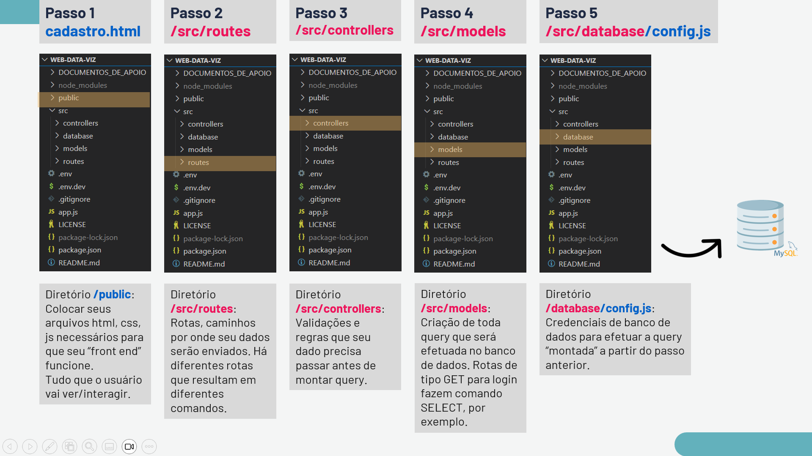

Acesse o arquivo app.js e parametrize o ambiente.

Se você estiver utilizando o Ambiente de Produção (remoto), comente a linha 2 e deixe habilitada a linha 1 onde está o valor var ambiente_processo = 'producao';

Se você estiver utilizando o Ambiente de Desenvolvimento (local), comente a linha 1 e deixe habilitada a linha 2 onde está o valor var ambiente_processo = 'desenvolvimento';

Adicione as credenciais de Banco de Dados no arquivo .env ou em .end.dev, seguindo as instruções neste.

Acesse este repositório no seu terminal (GitBash ou VSCode) e execute os comandos abaixo:

npm i

O comando acima irá instalar as bibliotecas necessárias para o funcionamento do projeto. As bibliotecas a serem instaladas estão listadas no arquivo package.json então é muito importante que este não seja alterado. Será criada uma nova pasta/diretório chamado node_modules quando o comando for finalizado, que é onde as bibliotecas estão localizadas. Não altere a pasta/diretório.

npm start
O comando acima irá iniciar seu projeto e efetuar os comandos de acordo com a sua parametrização feita nos passos anteriores.

Para "ver" seu projeto funcionando, acesse em seu navegador o caminho informado no terminal.

Caso queira parar a execução, tecle CTRL+C no terminal em que o projeto está rodando.

"Recurso? O que é?" Enquanto no Banco de Dados chamamos as tabelas de "entidades", quando tratamos de desenvolvimento WEB usamos a palavra "recurso" para se referir a algo que podemos criar, ler, atualizar ou deletar [1]. Estas ações são conhecidas como CRUD: Create, Read, Update e Delete. Para acessar cada ação, usamos os métodos HTTP: POST, GET, PUT e DELETE [2]. (Há outros verbos, porém com estes já conseguimos efetuar CRUDs).

Tabela para ajudar a fazer a associação

C.R.U.D	Ação	Tradução	Verbo HTTP *	Comando BD
C	Create	Criar	POST	INSERT
R	Read	Ler	GET	SELECT
U	Update	Atualizar	PUT	UPDATE
D	Delete	Deletar	DELETE	DELETE
* Você verá o verbo HTTP sendo apontado nos arquivos em /routes

"E no meu projeto, o que seria um recurso?" Em web-data-viz manipulamos os recursos usuário, aviso e medida. Podemos conferir isso vendo para quais entidades foram criados os caminhos de inserção e captura de dados, que envolve os diretórios routes, controllers e models.

Abaixo, uma figura que ajuda a compreender o caminho percorrido para, por exemplo, efetuar o cadastro de um usuário:

Entendi o que é um recurso e gostaria de adicionar um novo ao meu projeto! Como faz?

Primeiro, crie a tabela no Banco de Dados referente a este recurso. Exemplos de recursos comuns de serem adicionados ao projeto no primeiro semestre: Silo, Aquário, Sala, Andar, Endereço, Mercado, Prateleira, Unidade, Carro, Caminhão...
Assim que criada a tabela, faça todo o caminho de front-end → routes → controllers → models replicando o que já existe!
Exemplo, se você quiser a funcionalidade de adicionar um novo Aquário, deve criar arquivos referentes ao aquario nos diretórios e replicar também as funções.